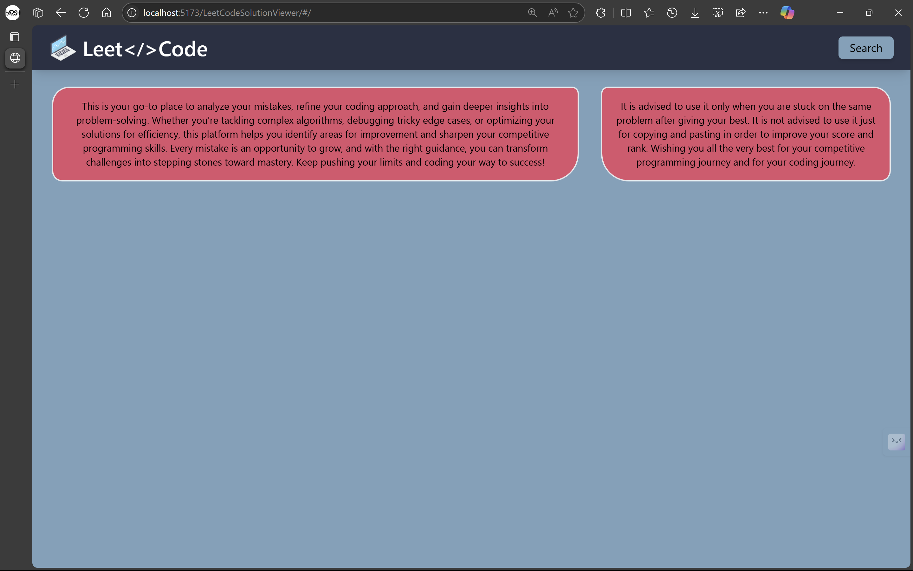
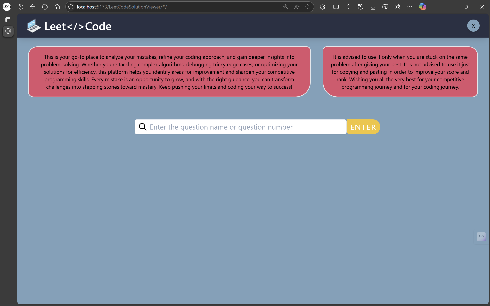
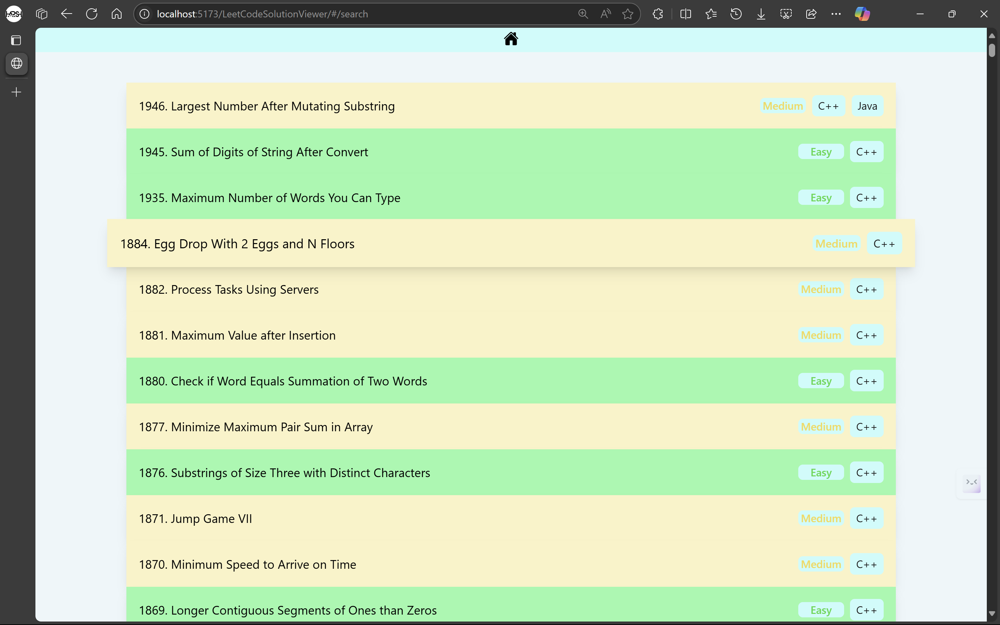
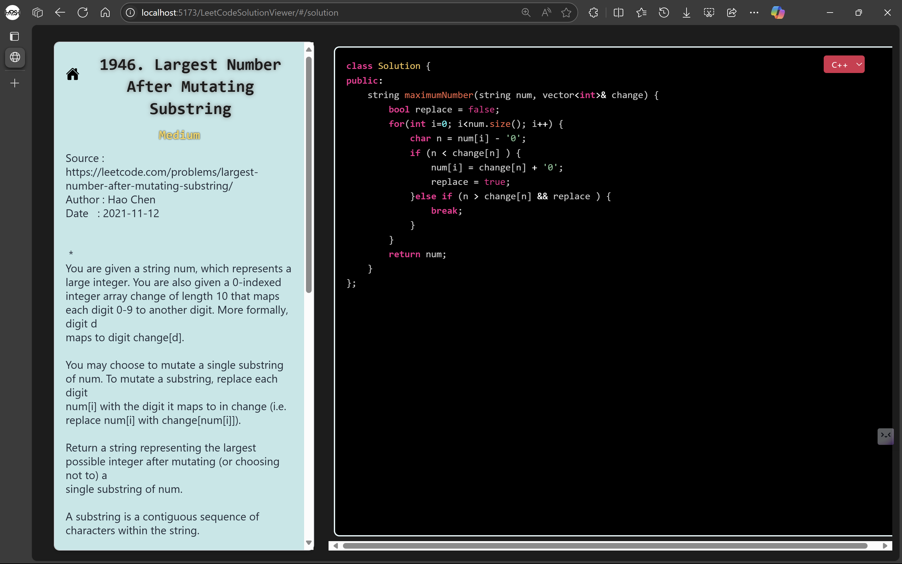

This is my second project on Web Development of my coding journey under GDSC-IITI Induction Task.
I would like to thank GDSC-IITI for introducing this induction task, so that I got a chance to learn basics of React which will 
significantly contribute in my Web Dev journey.

In this project, we were supposed to built a website which will let the users see the solution of different LeetCode Challenges
in mainly three languages viz C++, Java and Python. We were provided with the reference of haoel/leetcode repository, which
is a public repository containing solutions to many leetcode problems. 

This project comprises of following functionality :

Animated Homepage :
        Homepage comprises of animated logo and animated appearance of wishing para.

Search Button Functionality : 
        It helps user to search the question by its name or number.

Search Page Functionality : 
        A page where user can find the list of problems with a dynamic colouring of the problem based on its difficulty.
        It also comprises of a home button which will direct the user to home page again. The problem bars comprises of 
        problem number, problem name, difficulty and the language of available solutions.

Solution Page :
        The solution page comprises of :
            Question Subpage :
                It has question title, question number, a home button, question difficulty, question overview and context.
            Solution Subpage :
                The code snippet view of solution in attractive colours, with a language switcher button in it.

